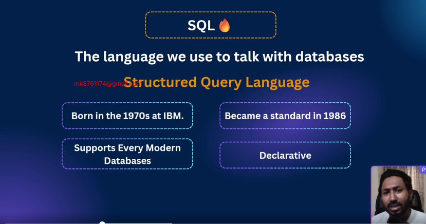
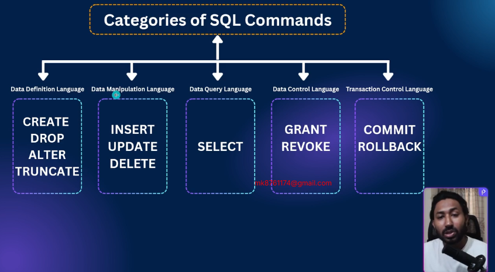

Slide Link: https://drive.google.com/file/d/1zPLUb2mSC4w2cT7YIV8jGYi5RWK__-q-/view?usp=drive_link

In this module, you’ll learn the fundamentals of PostgreSQL. From installing tools like pgAdmin and Beekeeper Studio to understanding key data types (Integer, Boolean, Character, Date, UUID), you’ll build a strong base. You’ll also practice creating and dropping databases/tables, applying constraints, and exploring different insert methods.
By the end,
## 44-1 Intro to SQL

- SQL Is declarative language
- You tell the database what you want, not how to do it. (database will manage it)
- lets see a sql statement
```bash
SELECT name FROM students WHERE age > 18 
```

- `Data Definition Language` :  CREATE, DROP, ALTER TRUNCATE
- `Data Manipulation Language` : INSERT, UPDATE, DELETE
- `Data Query Language` : SELECT
- `Data Control Language` : GRANT, REVOKE
- `Transaction Control` : COMMIT, ROLLBACK

- So, SQL is a declarative language to interact with databases. It’s old but gold, and still the backbone of all modern data systems
- It’s also powering the future with AI