Slide Link: https://drive.google.com/file/d/1zPLUb2mSC4w2cT7YIV8jGYi5RWK__-q-/view?usp=drive_link

In this module, you’ll learn the fundamentals of PostgreSQL. From installing tools like pgAdmin and Beekeeper Studio to understanding key data types (Integer, Boolean, Character, Date, UUID), you’ll build a strong base. You’ll also practice creating and dropping databases/tables, applying constraints, and exploring different insert methods.
By the end,
## 44-1 Intro to SQL

- SQL Is declarative language
- You tell the database what you want, not how to do it. (database will manage it)
- lets see a sql statement
```bash
SELECT name FROM students WHERE age > 18 
```

- `Data Definition Language` :  CREATE, DROP, ALTER TRUNCATE
- `Data Manipulation Language` : INSERT, UPDATE, DELETE
- `Data Query Language` : SELECT
- `Data Control Language` : GRANT, REVOKE
- `Transaction Control` : COMMIT, ROLLBACK

- So, SQL is a declarative language to interact with databases. It’s old but gold, and still the backbone of all modern data systems
- It’s also powering the future with AI
## 44-2 pgAdmin Basics
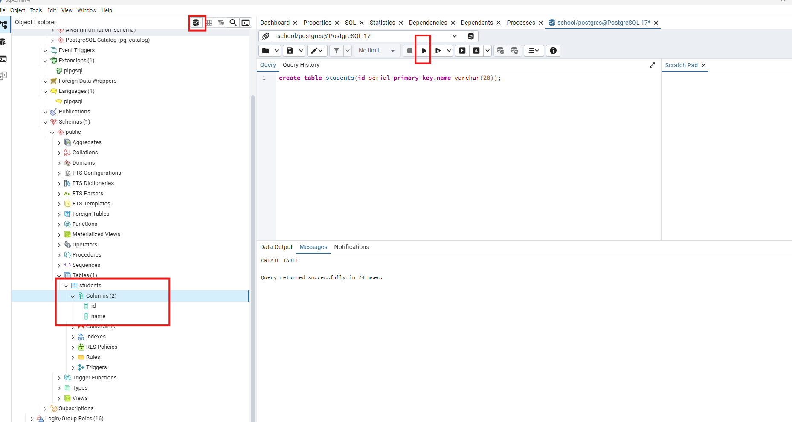
## 44-3 Install Beekeeper Studio
 - run code control + enter
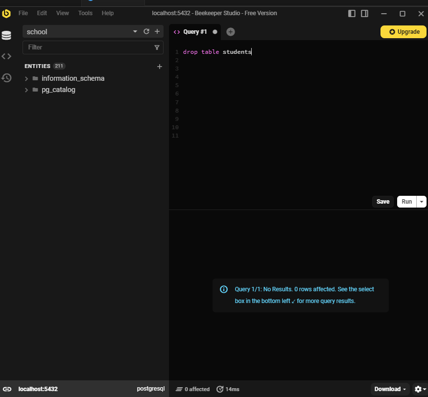
## 44-4 Integer & Boolean Types
- we can set data type to the attributes of a table 
- Setting data types improves :
    1. Data Accuracy
    2. Memory Efficiency
    3. Performance 
    4. Clarity and Constrains  
    ### Data Type
- `Boolean (we will commonly use)` 
- `Numbers (we will commonly use)` - 
- Binary 
- `Date/Time (we will commonly use)`
- json
- `Character (we will commonly use)`
- `UUID (we will commonly use)`
- Array 
- XML
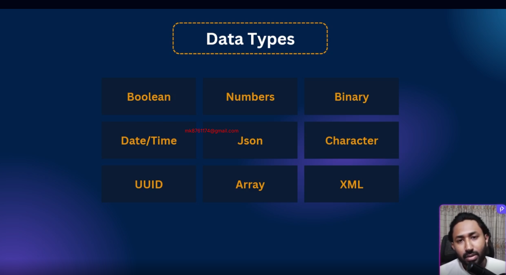

#### Small Int (int2)
- `Storage` : 2 bytes 
- `Range` : -32,768 to +32,767
- `Use case` : Small numbers (like age,quantity)

##### Integer (int4)
- `Storage` : 4 bytes 
- `Range` : ~ -2B to +2B
- `Use case` : Default choice for whole numbers

##### Bigint (int8)
- `Storage` : 8 bytes 
- `Range` : ~ -9 quintillion to +9 quintillion
- `Use case` : Very large numbers (IDs,counters)


##### Real (float4)
- `Storage` : 4 bytes
- `Range` : ~6 decimal digits precision
- `Use case` : Approximate values (e.g.,sensor data)

##### DOUBLE PRECISION (float8)
- `Storage` : 4 bytes
- `Range` : ~15 decimal digits precision
- `Use case` : Higher precision calculations

##### NUMERIC / DECIMAL
- `Storage` : variable
- `Range` : User-defined precision (exact)
- `Use case` : Money, financial calculations

##### SERIAL
- `Storage` : 4 bytes (auto-increment integer)
- `Range` : 1 to 2,147,483,647
- `Use case` : Auto-incrementing IDs, primary keys
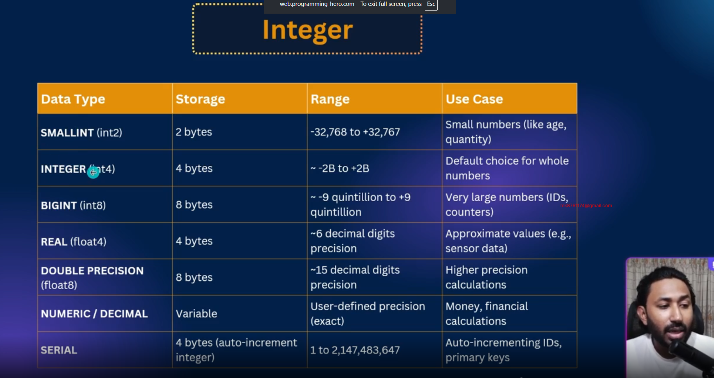

## 44-5 Character, Date & UUID Types
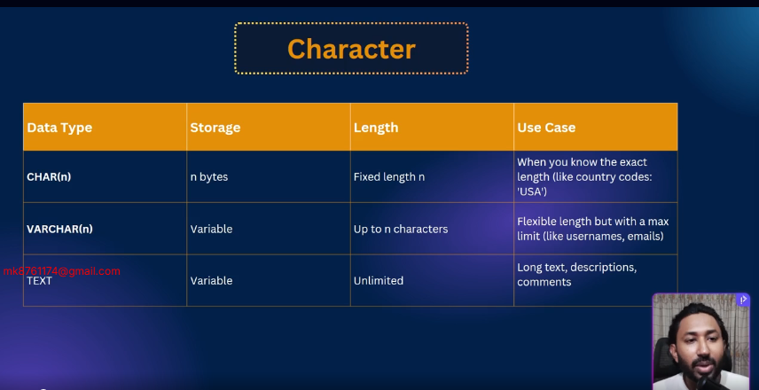
#### CHAR

- `Storage` : n bytes
- `Length` : Fixed length n
- `Use case` : When you know the exact length (like country codes:'USA')

#### VARCHAR

- `Storage` : Variable
- `Length` : Up to n characters
- `Use case` : Flexible length but with a max limit (like usernames, emails)

#### TEXT

- `Storage` : Variable
- `Length` : unlimited
- `Use case` : Long text, descriptions, comments
### DATE 
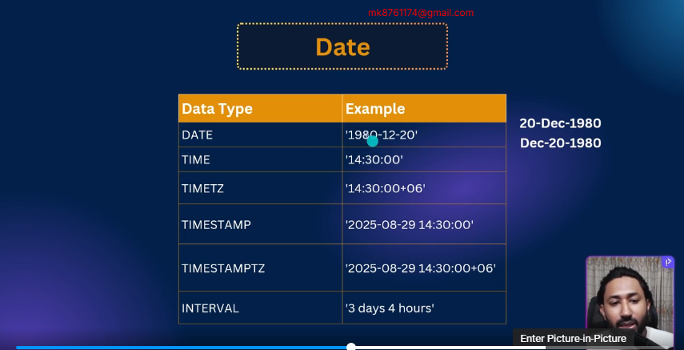
### UUID universal unique identifier
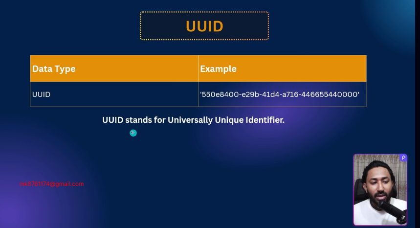

## 44-6 Create & Drop DB/Table
- Create database 

```bash
create database school;
```

- Delete a database 
```bash
drop database school;
```
- create a table 

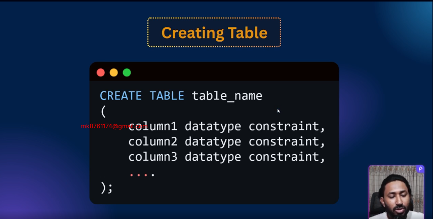
```bash
CREATE TABLE students (
  id serial,
  name varchar(50),
  age int,
  isActive boolean,
  dob date 
)
```

- delete a table 

```bash
drop table students;
```

- there is a safe way to delete a table (if exists delete)

```bash
drop table if exists students; 
```
## 44-7 Column Constraints
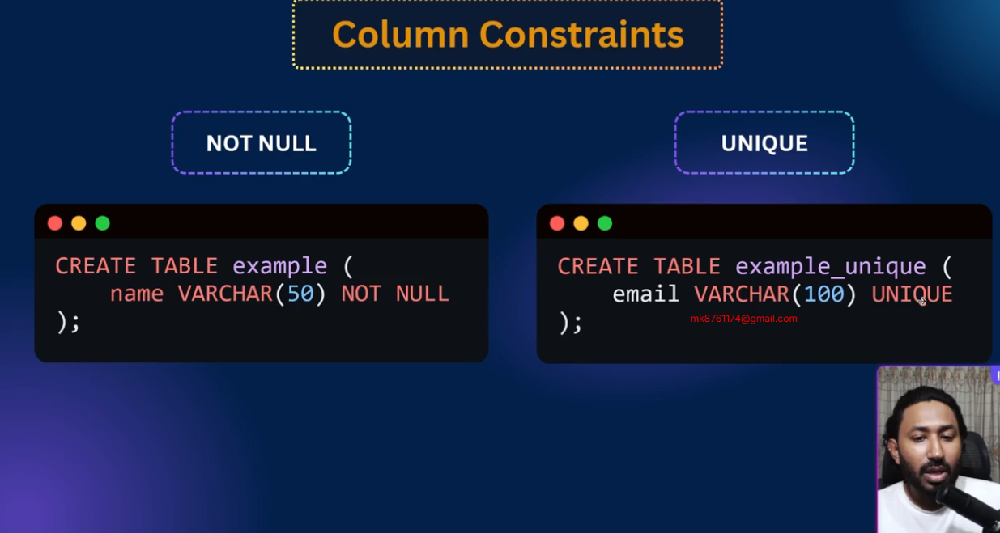
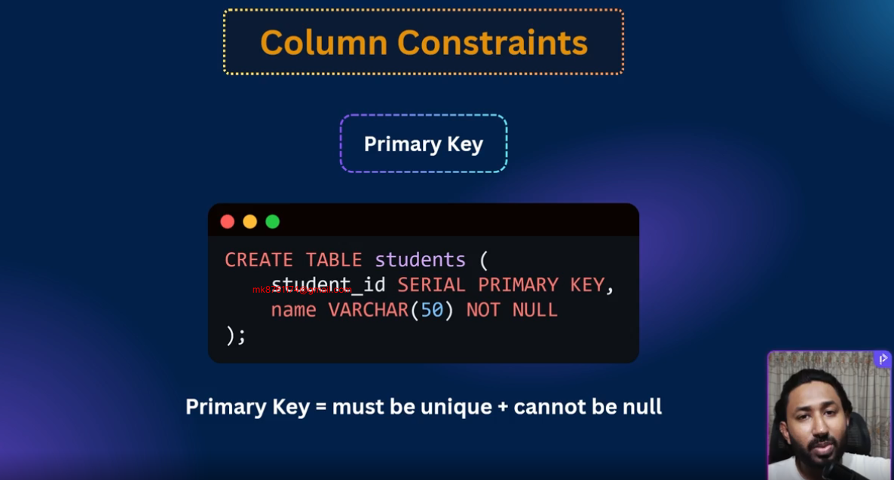
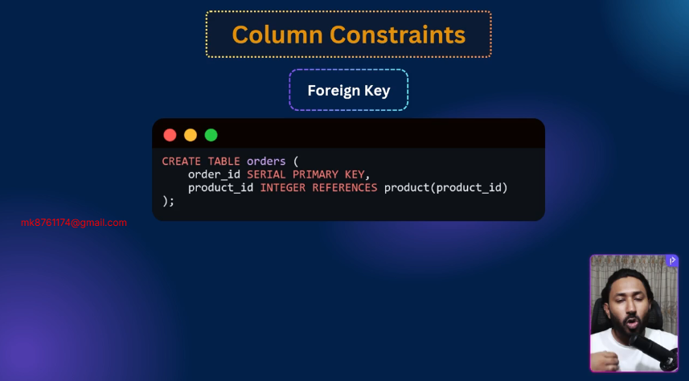
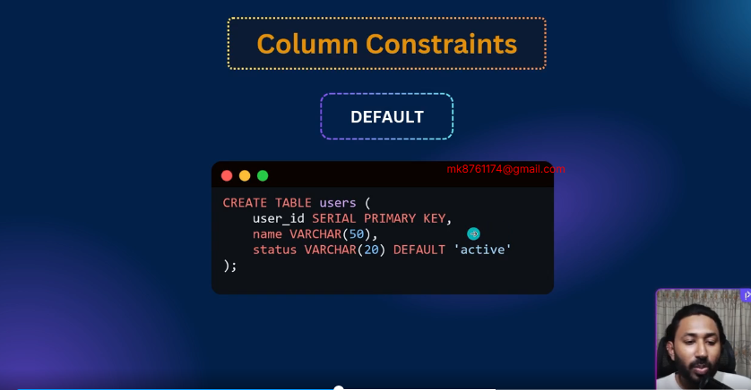
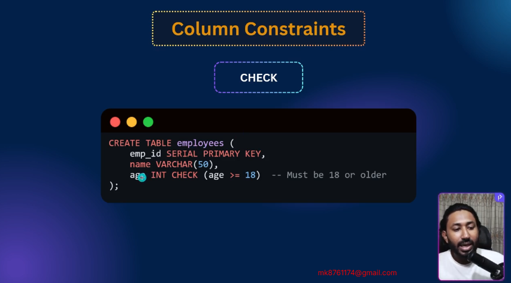
```sql
CREATE TABLE students (
  student_id SERIAL PRIMARY KEY,
  full_name  VARCHAR(100) NOT NULL,
  email  VARCHAR(100) UNIQUE, -- email  VARCHAR(100) UNIQUE NOT NULL,
  age INT CHECK(age >= 18),
  status VARCHAR(20) DEFAULT 'active'
)
```